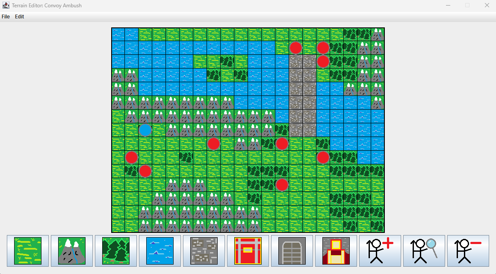

# Personal Project: Terrain Editor

This project allows users to open, edit, and save grid-based 2D maps for overhead strategy games. I've 
modded the GameBoy Advance Fire Emblem games before, and the existing tools can be daunting due to their complexity. 
This tool is much easier to use than those other tools, and ideal for the initial planning stages of a strategy 
game level. This tool also allows its users to freely add player, enemy, and ally units to the map without the terrain
needing to be finalized first.

To run the application, clone the repository into your IDE of choice, then run TerrainEditor.java. 
